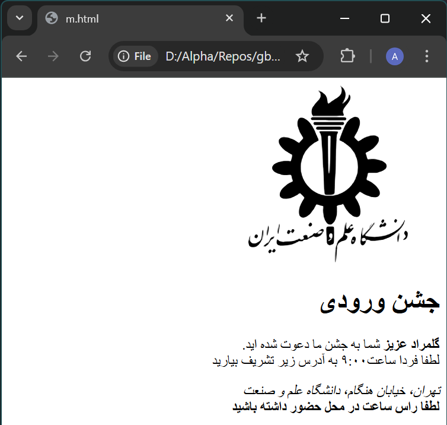

## فولدربندی
لوگوی دانشگاه را از [این لینک](https://www.svgrepo.com/svg/329645/iust) دانلود کنید.
ساختار فایل‌های این پروژه به صورت زیر است:

```
S10/HW/WS/
invitation-with-logo
├── assets
│   └── images
│       └── logo.svg
└── index.html
```

## جزئیات
ظاهر کلی برنامه بدین صورت است:
<div style="width:70%;  margin-left: auto;margin-right: auto;">



</div>

انجمن علمی دانشکده کامپیوتر می‌خواهد جشنی بزرگی ترتیب دهد. انجمن علمی می‌خواهد برای جلوگیری از قطع شدن درختان، از ارسال نامه‌های کاغذی خودداری کند و از صفحات وب استفاده کند.
او از شما می‌خواهد که برای وی یک صفحه ساده وب برای دعوت‌نامه طراحی کنید که شامل لوگوی دانشگاه نیز باشد.

## ساختار کلی دعوت‌نامه
به صورت کلی کد این دعوت‌نامه از ۶ بخش تشکیل شده است:
- بخش اول برای تنظیم جهت (*direction*)
- بخش دوم برای نمایش لوگو
- ۴ بخش دیگر همان بخش‌های مشخص شده در ظاهر برنامه هستند

توضیحات پیاده‌سازی این بخش‌ها را در ادامه می‌بینید.

## بخش اول: تنظیم جهت
1. کل صفحه باید به‌صورت راست‌چین باشد. برای این کار ابتدا تگ `body` را اضافه کرده و سپس `dir` مناسب را به آن بدهید.

## بخش دوم: نمایش لوگو
1. آدرس‌دهی عکس باید به صورت نسبی و درست باشد و تصویر به درستی بارگذاری شود.
2. درصورت عدم بارگذاری درست عکس، متن `logo` به‌جای آن نمایش داده شود.
3. عکس باید دارای عرض **۲۵۰** و ارتفاع **۲۰۰** باشد.
4. متن `alt` باید دقیقا `logo` باشد (کوچک و بزرگی حروف مهم است).

## بخش سوم: عنوان جشن
برای نوشتن توضیحات این بخش، از تگ `h1` با آیدی `title` استفاده کنید.


## بخش چهارم: توضیحات جشن
1. این بخش از ۲ خط تشکیل شده است.
2. از تگ پاراگراف (`p`) با ‌آیدی `description` استفاده کنید.
3. برای اعمال فاصله بین خطوط از تگ `br` استفاده کنید.
4. نام مخاطب (*گلمراد عزیز*) باید در تگ `strong` قرار بگیرد.
5. برای نمایش ساعت از تگ `time` استفاده کنید. توجه کنید حتما ویژگی `datetime` را مقداردهی کنید.

## بخش پنجم: آدرس جشن
1. از تگ `address` به همراه آیدی `address` استفاده کنید.
2. همچنین از تگ `i` برای مورب کردن آدرس استفاده کنید.

## بخش ششم: نکته مهم جشن
1. از تگ `b` و با آیدی `important-description` استفاده کنید.
2. متن "لطفا راس ساعت در محل حضور داشته باشید" را در آن قرار دهید.

## نکات
* مطمئن شوید که charset و lang سند به درستی تنظیم شده‌اند تا متون فارسی به درستی نمایش داده شوند.
* شما تنها مجاز به اعمال تغییرات در فایل `index.html` هستید.
* تکلیف را مطابق با فولدربندی اشاره شده در اول این صفحه کامیت کنید.


{/* <details>
<summary>
### جواب
</summary>

```html
<!DOCTYPE html>
<html lang="fa-IR">
    <head>
        <meta charset="UTF-8" />
    </head>
    <body dir="rtl">
        
        
        <h1 id="title">جشن ورودی</h1>
        <p id="description"><strong>گلمراد عزیز</strong> شما به جشن ما دعوت شده اید.</br>
         لطفا فردا ساعت<time>۹:۰۰</time> به آدرس زیر تشریف بیارید</p>
        <address id="address">تهران، خیابان هنگام، دانشگاه علم و صنعت</address>
        <b id="important-description">لطفا راس ساعت در محل حضور داشته باشید</b>
    </body>
</html>
```

</details> */}