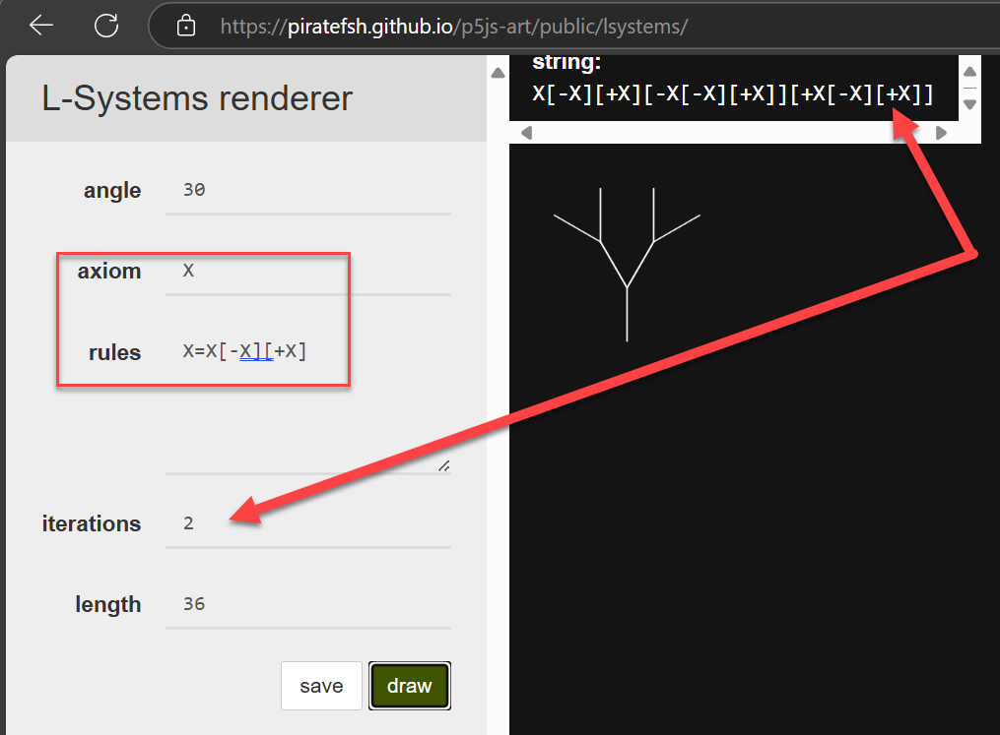
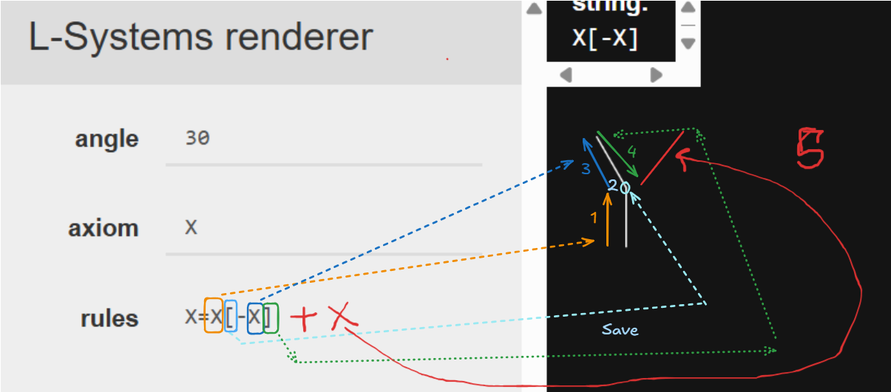

import { Steps } from '@astrojs/starlight/components';
import { Card, CardGrid } from '@astrojs/starlight/components';
import { Aside } from '@astrojs/starlight/components';
import LSystemVisualizer from '../../../components/LSystemVisualizer.astro';
import WordLSystem from '../../../components/PersianLSystemVisualizer.astro';
import FractalLSystem from '../../../components/Fractal.astro'

# آموزش سیستم‌های L: از کلمات تا نمادها

## بخش اول: مثال‌های فارسی

<CardGrid>
  <Card title="آکسیوم چیست؟" icon="open-book">
    آکسیوم حالت اولیه سیستم است. مثل یک کلمه یا نماد شروع که قوانین روی آن اعمال می‌شوند.
  </Card>
  <Card title="قوانین چیست؟" icon="setting">
    قوانین دستورالعمل‌هایی هستند که مشخص می‌کنند هر عنصر چگونه به عناصر دیگر تبدیل شود.
  </Card>
</CardGrid>

### مثال ۱: سیستم تک‌قانونی

<Aside type="tip">
**قانون ساده**: `کتاب -> کتاب خوب`

نتایج مراحل مختلف:
- تکرار ۰ (آکسیوم): `کتاب`
- تکرار ۱: `کتاب خوب`
- تکرار ۲: `کتاب خوب خوب`
- تکرار ۳: `کتاب خوب خوب خوب`
</Aside>

در این مثال ساده می‌بینیم که در هر تکرار، کلمه "کتاب" با عبارت "کتاب خوب" جایگزین می‌شود. کلمه "خوب" تغییر نمی‌کند چون قانونی برای آن تعریف نشده است. در هر تکرار، رشته طولانی‌تر می‌شود و الگوی رشد را می‌توانیم مشاهده کنیم.

### مثال ۲: سیستم دو‌قانونی

<Aside>
**قوانین**:
1. `کتاب -> کتاب خوب`
2. `خوب -> گلمراد`

نتایج مراحل:
- تکرار ۰: `کتاب`
- تکرار ۱: `کتاب خوب`
- تکرار ۲: `کتاب خوب گلمراد`
- تکرار ۳: `کتاب خوب گلمراد گلمراد`
</Aside>

<CardGrid>
  <Card title="نکته مهم ۱" icon="warning">
    جایگزینی‌ها همزمان انجام می‌شوند. یعنی ابتدا کل رشته را می‌خوانیم، سپس همه تغییرات را یکجا اعمال می‌کنیم.
  </Card>
  <Card title="نکته مهم ۲" icon="information">
    در هر مرحله، تمام کلماتی که قانون دارند جایگزین می‌شوند، حتی اگر در مرحله قبل اضافه شده باشند.
  </Card>
</CardGrid>

<WordLSystem/>

## بخش دوم: سیستم‌های نمادین

<Aside type="tip">
در سیستم‌های L نمادین، از حروف و علائم خاص استفاده می‌کنیم:
- `F`: حرکت به جلو با رسم خط
- `+`: چرخش به راست (مثلاً ۶۰ درجه)
- `-`: چرخش به چپ
- `[`: ذخیره موقعیت فعلی
- `]`: بازگشت به موقعیت ذخیره شده
</Aside>

### مثال: منحنی کج ساده

**آکسیوم**: `F`
**قانون**: `F -> F+F-F`
**زاویه چرخش**: 90 درجه

نتایج مراحل مختلف:
- تکرار ۰: `F`
- تکرار ۱: `F+F-F`
- تکرار ۲: `F+F-F+F+F-F-F+F-F`

### شبیه‌ساز 1 (proccess_ins تابع):
این تابع تعداد تکرار `n` را میگیرد و عبارت مربوط به آن را تولید میکند
<LSystemVisualizer />


### شبیه ساز 2 (تابع follow):
این تابع یک عبارت میگیرد و تک تک حرف های آنرا اجرا و طرح را میکشد.
<FractalLSystem/>

## سیستم های دوشاخه یا درختی
این سیستم قبلی فقط دور خود میچرخد. حتی با زیاد کردن تعداد دور ها دور خود خواهد چرخید اما ما میخواهیم شاخه بزنیم. برای اینکار در فرمول از `[` و `]` استفاده میکنیم. عکس زیر را ببینید.



### چگونه این را پیاده سازی کنیم؟
تابع `follow` یک عبارت مثل `F+F-F+F+F-F-F+F-F` را در آرگومان `s` میگیرد و آنرا روی صفحه میکشد
```python
def follow(s):
    """Draw the L-system string using turtle graphics"""
    # something to do
    for c in s:
        if c == 'f':
            turtle.forward(x)
        elif c == '-':
            turtle.left(a)
        elif c == '+':
            turtle.right(a)
        elif c == '[':
            # Save the current position and angle
        elif c == ']':
            # Restore the last saved position and angle
```

در تابع بالا استفاده از درسنامه قبلی جاهای خالی را موقعیت میگیریم و ذخیره میکنیم..


### ساده سازی برای تصور
بیاید عکس بالا را برای ساده سازی فرمول ساده تر بدیم. تعداد تکرار را 1 بگذاریم
شکلی زیر پدید می آید. مراحل را مطابق شکل بکشید. 


تنها یک بخش مانده به فرمول اضافه کنیم تا شاخه دوم پدید آید و آن `+x` است که با رنگ قرمز به آن اضافه شد.